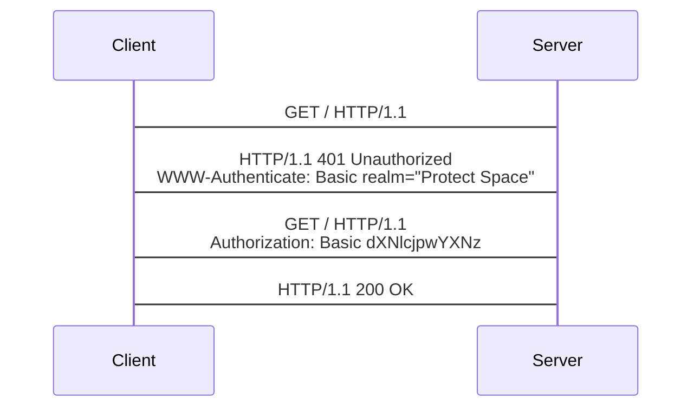

HTTP 基本认证（Basic Authentication）是在[RFC7617 - IETF]中定义的一种认证方式，它使用以Base64编码的用户ID/密码对作为用户的身份凭证。由于HTTP Basic认证是以明文的形式传输用户ID以及密码（Base64是一种可逆的编码方式），在未搭配HTTPS的情况下使用是不安全的。

HTTP Basic认证主要通过HTTP的`WWW-Authenticate`响应头部以及`Authorization`请求头部进行实现，其流程大致为：

- 客户端在未提供用户身份凭证的情况下请求受限资源；
- 服务端接受请求，返回带有`WWW-Authenticate`响应头部的`401 Unauthorized`响应；
- 客户端获得用户ID以及密码，编码后发出带有`Authorization`请求头部的请求；
- 服务端根据请求提供的身份凭证返回请求的资源或是返回错误。

## `WWW-Authenticate`响应头部

`WWW-Authenticate`响应头部用于告知客户端使用何种验证方式，它通常与401响应（`Unauthorized`）一起返回。`WWW-Authenticate`的格式如下：

```
WWW-Authenticate: <type> [realm=<realm>] [charset=<charset>]
```

`WWW-Authenticate`可设置的指令为：

- `type`：验证的类型，常见的值有`Basic`、`Bearer`、`OAuth`等，更多的值可参考[HTTP Authentication Schemes - IANA]。在本文中将使用`Basic`值。
- `realm`：保护区的描述，在未指定的情况下客户端默认显示为格式化的主机名。当使用`Basic`认证时，`realm`为必须的指令。
- `charset`：告知客户端用户名和密码首选的编码方式，唯一允许的值为不区分大小写的`UTF-8`。

以下为使用Basic认证时服务器返回的响应头示例：

```
HTTP/1.1 401 Unauthorized
WWW-Authenticate: Basic realm="Protect Space" charset="UTF-8"
```

## `Authorization`请求头部

`Authorization`用于设置含有服务器验证用户所需的身份凭证，它通常在服务器返回带有`WWW-Authenticate`响应头部的`401 Unauthorized`响应之后的请求中发送。

```
Authorization: <type> <credentials>
```

`Authorization`可设置的指令为：

- `type`：即上文中提到的验证类型，`Authorization`头部中设置的值将与`WWW-Authenticate`返回的类型保持一致，在本文中即为`Basic`。
- `credentials`：用户的身份凭证。

其中，使用Basic认证时，身份凭证为一个使用`:`连接的用户名及密码，并使用Base64进行编码。

下面是以JavaScript实现的请求示例：

```js
const username = 'user';
const password = 'pass';
const credentials = btoa(username + ':' + password);
console.log(credentials);
// dXNlcjpwYXNz

fetch(url, {
  headers: {
    Authorization: `Basic ${credentials}`
  }
});
```

发出的请求头部示例如：

```
GET / HTTP/1.1
Authorization: Basic dXNlcjpwYXNz
```

## 一个简单的验证交互示例



首先，客户端对服务器的资源`/`发起GET请求：

```
GET / HTTP/1.1
```

服务器接收到请求后，返回状态为401的响应，并通过`WWW-Authenticate`响应头部告知客户端使用Basic认证：

```
HTTP/1.1 401 Unauthorized
WWW-Authenticate: Basic realm="Protected space"
```

客户端得到响应后，通过用户输入或其它方式获取用户名及密码，并以上文中提到的方式编码获得身份凭证，通过`Authorization`请求头部发送至服务端。

```
GET / HTTP/1.1
Authorization: Basic dXNlcjpwYXNz
```

在服务端接收到带有身份凭证的请求后，会根据用户的身份凭证返回资源或错误。如当身份凭证验证通过时返回200相应：

```
HTTP/1.1 200 OK
```

或是当身份凭证验证失败时返回403响应。

```
HTTP/1.1 403 Forbidden
```

## 参考资料

- [RFC7617 - IETF]
- [HTTP Authentication Schemes - IANA]
- [Authentication - MDN](https://developer.mozilla.org/en-US/docs/Web/HTTP/Authentication)

[RFC7617 - IETF]: https://tools.ietf.org/html/rfc7617
[HTTP Authentication Schemes - IANA]: https://www.iana.org/assignments/http-authschemes/http-authschemes.xhtml